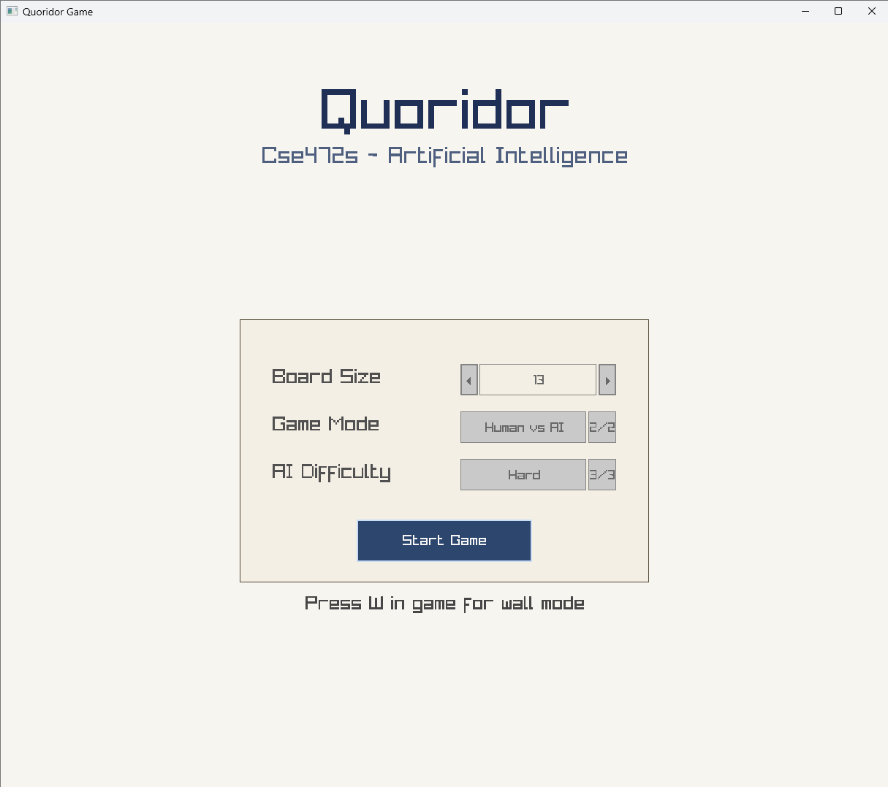

# Quoridor Game

A complete implementation of the classic Quoridor board game built with **C++** and **Raylib**, developed as a term project for CSE472s — Artificial Intelligence, Spring 2026.

---

## Table of Contents

- [Game Description](#game-description)
- [Screenshots](#screenshots)
- [Features](#features)
- [Installation & Build Instructions](#installation--build-instructions)
- [How to Run](#how-to-run)
- [Controls](#controls)
- [Game Modes & AI Difficulty](#game-modes--ai-difficulty)
- [Demo Video](#demo-video)

---

## Game Description

Quoridor is an abstract strategy board game invented by Mirko Marchesi (1997), winner of the Mensa Mind Game award. Two players compete to be the first to move their pawn across the board to the opposite side.

**Core Rules:**
- The game is played on a configurable grid (default 9×9).
- Each player starts at the center of their baseline and must reach the opposite baseline.
- On each turn a player must either **move their pawn** or **place a wall**.
- Pawns move one square orthogonally. If an opponent pawn is adjacent, you may **jump over** it (if not blocked by a wall), or move **diagonally around** it if the direct jump is blocked.
- Walls are two cells long and placed in the grooves between cells. They cannot overlap, cross, or completely cut off any player's path to their goal.
- Each player starts with **10 walls**. Walls cannot be taken back once placed.
- The first player whose pawn reaches any cell on the opponent's baseline wins.

---

## Screenshots

> *(Add screenshots here — e.g., menu screen, mid-game board, AI game, win screen)*

| Main Menu | In-Game | Wall Placement |
|-----------|---------|----------------|
|  |  |  |

---

## Features

### Core Features
- Full 2-player Quoridor ruleset including jump and diagonal-jump moves
- Human vs. Human and Human vs. AI game modes
- Valid move highlighting for the current player's pawn
- Wall placement with live preview and orientation toggle
- Wall conflict and path-blocking detection (walls can never strand a player)
- Win detection with on-screen announcement

### Bonus Features
- **Save / Load** — Persist game state to `savegame.qdr` at any point and resume later
- **Undo / Redo** — Step back and forward through move history (in Human vs. AI mode, undo reverts the AI's reply as well, keeping turn parity)
- **Custom Board Sizes** — Choose any board size from 5×5 to 20×20 from the main menu

---

## Installation & Build Instructions

### Prerequisites

| Tool | Purpose |
|------|---------|
| [w64devkit](https://github.com/skeeto/w64devkit) (mingw-w64 GCC) | C++ compiler toolchain |
| [Raylib](https://www.raylib.com/) | Graphics library (place in `./raylib/`) |
| `mingw32-make` | Build system (bundled with w64devkit) |

### Directory Layout (Raylib)

The build system expects Raylib to be placed at the project root:

```
quoridor/
├── raylib/
│   ├── include/
│   │   └── raylib.h
│   └── lib/
│       └── libraylib.a
├── src/
├── include/
├── Makefile
└── ...
```

### Build

Open a w64devkit terminal in the project root, then:

```bash
# Debug build (with symbols)
mingw32-make

# Release build (optimized)
mingw32-make BUILD=RELEASE
```

The compiled executable will be output to the `build/` directory.

### Clean

```bash
mingw32-make clean
```

---

## How to Run

```bash
./build/quoridor.exe
```

> Make sure `raylib.dll` (if dynamically linked) is either in the same directory as the executable or on your `PATH`. If the build links statically, no extra DLL is needed.

The window opens at **900×820** and is **resizable** — the board and UI scale automatically to fit.

---

## Controls

### Menu Screen

| Input | Action |
|-------|--------|
| Mouse | Click dropdowns to select board size, game mode, and difficulty |
| Left Click "Start Game" | Begin the game |
| **Enter** | Quick-start with current settings |

### In-Game

| Input | Action |
|-------|--------|
| **Left Click** (on a highlighted cell) | Move pawn to that cell |
| **W** | Toggle wall placement mode on/off |
| **Right Click** | Rotate wall orientation (Horizontal ↔ Vertical) |
| **Left Click** (in wall mode) | Place wall at previewed position |
| **Escape** | Cancel current wall preview |

### HUD Buttons

| Button | Action |
|--------|--------|
| **Undo** | Undo the last move (undoes 2 moves in Human vs. AI to preserve turn order) |
| **Redo** | Redo an undone move |
| **Save** | Save the current game state to `savegame.qdr` |
| **Load** | Load the last saved game from `savegame.qdr` |
| **Reset** | Restart the current game with the same settings |
| **Main Menu** | Return to the main menu to change settings |

---

## Game Modes & AI Difficulty

### Modes
- **Human vs. Human** — Two players share one keyboard and mouse, taking turns locally.
- **Human vs. AI** — Player 1 is human; Player 2 is controlled by the AI. The AI moves instantly on its turn.

### AI Difficulty Levels

| Difficulty | Strategy | Description |
|------------|----------|-------------|
| **Easy** | Random | Selects a uniformly random valid move each turn. Good for first-time players. |
| **Medium** | Greedy | Evaluates every valid move with a one-ply heuristic: maximises `(opponent BFS distance − own BFS distance) + wall advantage`. Fast and plays sensibly. |
| **Hard** | Minimax (depth 2) with Alpha-Beta Pruning | Searches two plies ahead using the same distance-based evaluation function. Alpha-beta pruning eliminates branches that cannot affect the result, keeping it responsive. |

---

## Demo Video

> 📹 **[Watch the demo video here](#)** *(replace with your YouTube / Google Drive link)*

The video covers:
- Main menu walkthrough and configuration options
- Human vs. Human gameplay
- Human vs. AI gameplay across all difficulty levels
- Save, Load, Undo, and Redo demonstration

---

## Project Structure

```
quoridor/
├── src/
│   ├── ai/          # AI strategies (Random, Greedy, Minimax) and PathFinder
│   ├── model/       # Game logic: Board, State, Player, Wall, Move, Position
│   ├── controller/  # GameController — orchestrates moves, undo/redo, save/load
│   ├── ui/          # Raylib rendering: BoardRenderer, HudRenderer, InputHandler, Screens
│   └── persistence/ # SaveManager — serialization of game state
├── include/         # All header files (mirrors src/ structure)
├── assets/          # Fonts, icons, sounds
├── docs/uml/        # UML diagrams
├── build/           # Compiled output
├── lib/             # External library placeholders
├── tests/           # Unit tests
└── Makefile
```

---

## Team

Developed for CSE472s — Artificial Intelligence, Spring 2026.
